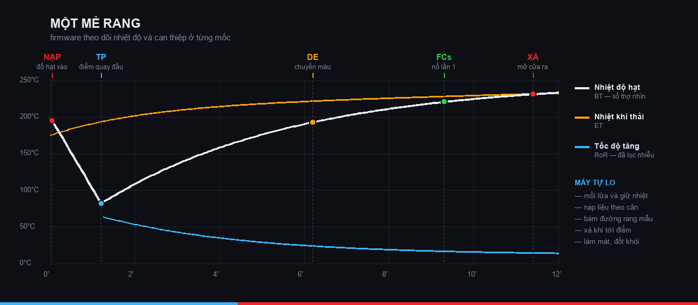
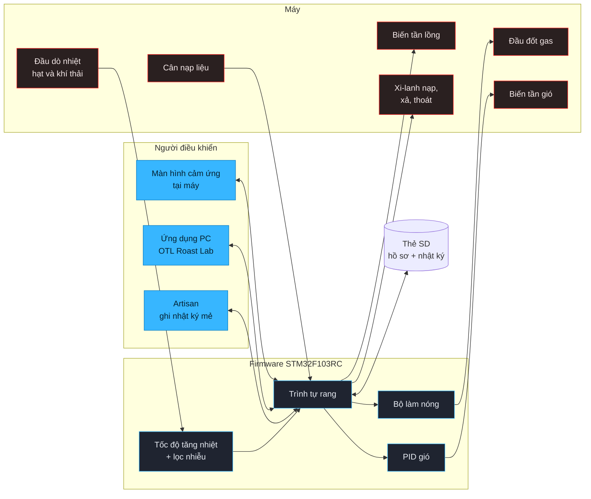

<p align="center">
  
</p>

<p align="center">
  <a href="https://github.com/TCL-DA/coffee-roaster-auto-control/actions/workflows/release.yml"></a>
  <a href="https://github.com/TCL-DA/coffee-roaster-auto-control/actions/workflows/smoke-stacks.yml"></a>
  <a href="https://github.com/TCL-DA/coffee-roaster-auto-control/actions/workflows/check-asset-sync.yml"></a>
</p>

<p align="center">
  
  
  
  
  
</p>

<h1 align="center">Coffee Roaster Auto Control</h1>

<p align="center">
  Firmware chạy máy rang cà phê công nghiệp <b>OTL</b><br>
  <sub>Firmware for OTL industrial coffee roasters · <a href="https://www.otlpro.com/">O Tesla Industry Co., Ltd</a></sub>
</p>

---

## Máy này làm gì

Người vận hành đổ hạt vào rồi bấm chạy. Từ đó tới lúc cà phê ra khay, **máy tự lo**:
mồi lửa, nạp liệu theo cân, giữ đường rang bám theo mẻ mẫu, xả khi tới điểm, làm mát
và đốt nốt khói.

<p align="center">
  
</p>

<p align="center"><sub>
Đường trắng là nhiệt độ hạt — con số người thợ nhìn. Cam là nhiệt khí thải.
Xanh là tốc độ tăng nhiệt, đã lọc nhiễu. Năm mốc dọc là những chỗ firmware ra quyết định.
</sub></p>

### Một mẻ đi qua những bước nào

| Mốc | Xảy ra chuyện gì | Máy làm gì |
|:--|:--|:--|
| **Làm nóng** | Lồng rang còn nguội | Mồi lửa, đưa nhiệt lên mức đặt rồi giữ ở đó chờ mẻ |
| **NẠP** | Hạt đổ vào, nhiệt tụt mạnh | Cân đúng khối lượng rồi mở cửa nạp |
| **TP** | Nhiệt chạm đáy và quay đầu lên | Mốc để tính toàn bộ phần còn lại của mẻ |
| **DE** | Hạt chuyển màu | Bắt đầu bám sát đường rang mẫu |
| **FCs** | Nổ lần một | Giai đoạn quyết định vị ngon — chỉnh gas sát hơn |
| **XẢ** | Tới điểm dừng | Mở cửa xả, chạy quạt làm mát, đốt nốt khói |

> [!NOTE]
> Máy dùng **một firmware duy nhất cho mọi cỡ**. Máy nào có gì thì khai trong
> [`include/Config.h`](include/Config.h) — không tách nhánh riêng cho từng model.

---

## Ai điều khiển được máy

Ba đường cùng nói chuyện với firmware một lúc. Firmware phân xử, và giữ chốt an toàn
bất kể ai ra lệnh.



---

## Bắt tay vào việc

```bash
pio run -e genericSTM32F103RC                  # build
pio run -e genericSTM32F103RC --target upload  # nạp qua ST-Link
pio run -e genericSTM32F103RC --target size    # xem RAM/Flash còn bao nhiêu
pio device monitor --baud 9600                 # đọc log debug
```

> [!IMPORTANT]
> **RAM mới là thứ chật, không phải Flash.** Bo mạch có 48 KB RAM và riêng các mảng
> ghi dữ liệu mẻ đã ăn gần hết. Thêm mảng nào cũng phải chạy `--target size` xem còn
> dư không — chi tiết trong [ARCHITECTURE.md](ARCHITECTURE.md).

---

## Mã nguồn nằm ở đâu

Mỗi hệ phụ một file header, đọc tên là biết nó lo phần nào.

| File | Lo việc gì |
|:--|:--|
| [`Config.h`](include/Config.h) | **Máy này có gì** — bật tắt từng tuỳ chọn lúc build |
| [`Define.h`](include/Define.h) | Biến toàn cục, chân cắm, địa chỉ truyền thông |
| [`Program.h`](include/Program.h) | Trình tự rang — trái tim của firmware |
| `Preheat*.h` | Làm nóng máy, hai kiểu chọn lúc build |
| [`PID_Airflow.h`](include/PID_Airflow.h) | Giữ áp hút ổn định, có bảng bù và tự chỉnh |
| [`RoR_Control.h`](include/RoR_Control.h) | Tính tốc độ tăng nhiệt, lọc nhiễu cảm biến |
| `Modbus_*.h` | Nói chuyện với màn hình, thiết bị trên bus, và Artisan |
| `PC_Link*.h` | Cầu nối sang ứng dụng máy tính |
| [`ScaleFeeder.h`](include/ScaleFeeder.h) | Đọc cân, nạp liệu tự học |

<details>
<summary><b>Cây thư mục đầy đủ</b></summary>

```
include/     module firmware — mỗi hệ phụ một header
src/         điểm vào chương trình
protocol/    định nghĩa cầu nối, sinh ra cho firmware / Python / JS
tools/       tiện ích chạy trên máy tính — máy rang ảo, tester serial,
             bộ sinh màn hình HMI, chuyển tài liệu sang Markdown
docs/        hồ sơ cấu hình từng máy, tài liệu tra cứu, kế hoạch
html/        trang offline — mô phỏng, hướng dẫn, bản nháp giao diện
assets/      logo, icon, ảnh bitmap cho màn hình
data/        nội dung thẻ SD
```

</details>

---

## Đọc thêm

| Tài liệu | Nội dung |
|:--|:--|
| [ARCHITECTURE.md](ARCHITECTURE.md) | Bản đồ module, ngân sách bộ nhớ, nhịp vòng điều khiển |
| [FEATURES.md](FEATURES.md) | Mô tả từng tính năng |
| [CLAUDE.md](CLAUDE.md) | Quy ước, giới hạn phần cứng, luật an toàn khi sửa code |
| [docs/](docs/) | Hồ sơ cấu hình từng máy, ghi chú cân chỉnh, tài liệu tra cứu |

---

## An toàn

> [!WARNING]
> Firmware này điều khiển **gas, lửa và bộ phận chuyển động**. Hai luật không được phá:
>
> **1. Không gọi SD, Modbus, Serial hay `delay()` trong ISR.**
> `timerPoll_1000ms()` chạy trong ngắt. Đặt cờ rồi xử lý ở `loop()`.
>
> **2. Chạy [release-check](.claude/skills/release-check/) trước khi nạp máy khách.**
> Kiểm cờ debug đã tắt, giới hạn gas hợp lý, các mốc thời gian đúng.

---

<p align="center">
  <sub><b>O Tesla Industry Co., Ltd</b> — máy rang cà phê công nghiệp<br>
  <a href="https://www.otlpro.com/">otlpro.com</a></sub>
</p>
