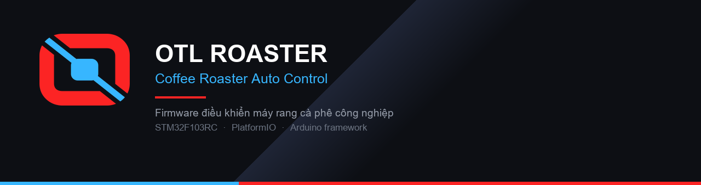

<p align="center">
  
</p>

<p align="center">
  
  
  
  
  
</p>

# Coffee Roaster Auto Control

Firmware for **OTL industrial coffee roasters**, built by
[O Tesla Industry Co., Ltd](https://www.otlpro.com/).

It runs the whole roast: reads bean and exhaust temperature, drives the gas burner and
airflow, follows a stored roast profile, moves the charge and discharge cylinders, and
logs the batch — while a Delta HMI, a PC application and Artisan can all talk to the
machine at the same time.

> Firmware điều khiển máy rang cà phê công nghiệp OTL — chạy trọn mẻ rang, từ mồi lửa,
> nạp liệu, giữ đường rang, tới xả liệu và ghi nhật ký mẻ.

---

## What it does

| | |
|---|---|
| **Roast control** | State machine driving a full batch: preheat → charge → roast → drop → cooling |
| **Temperature** | Bean and exhaust probes over RS485, Kalman-filtered, rate-of-rise computed like Artisan |
| **Burner** | Gas output via DAC with slew-rate limiting; supports both standard and premix burners |
| **Airflow** | Vacuum-based PID with a feed-forward table and self-tuning |
| **Profiles** | Roast profiles stored on SD card, replayed automatically |
| **Auto loader** | Load-cell feeder with a self-learning correction table |
| **Interfaces** | Delta HMI · PC application over a dedicated link · Artisan over Modbus RTU |
| **Options** | Afterburner, destoner, mixer and cooling, each switchable per machine |

One firmware covers every machine size. What a given machine has is declared in
[`include/Config.h`](include/Config.h) — no forked branches per model.

---

## Hardware

| | |
|---|---|
| MCU | STM32F103RC — 72 MHz Cortex-M3, 256 KB Flash, 48 KB RAM |
| Toolchain | PlatformIO + Arduino framework |
| Storage | SD card (roast profiles and batch logs) |
| Analog out | I²C DAC for burner and airflow |
| Field bus | RS485 Modbus — temperature controllers, inverters, I/O relay module |
| Operator panel | Delta HMI over serial |

---

## Quick start

```bash
pio run -e genericSTM32F103RC                  # build
pio run -e genericSTM32F103RC --target upload  # flash over ST-Link
pio run -e genericSTM32F103RC --target size    # check Flash / RAM headroom
pio device monitor --baud 9600                 # serial debug
```

RAM is the tight resource, not Flash. Check `--target size` after any change that adds
arrays — see [ARCHITECTURE.md](ARCHITECTURE.md) for the memory budget.

---

## Layout

```
include/     firmware modules — one header per subsystem
  Config.h        which options this machine has
  Define.h        global state, pins, Modbus addresses
  Program.h       roast state machine
  Preheat*.h      warm-up controllers
  PID_Airflow.h   vacuum PID + feed-forward
  Modbus_*.h       HMI, field bus, Artisan slave
  PC_Link*.h      PC application link
src/         entry point
protocol/    shared link definition, generated for firmware / Python / JS
tools/       desktop utilities — roaster simulator, serial testers, HMI screen generator
docs/        machine configuration records, references, guides, plans
html/        offline pages — simulator, guides, UI mock-ups
assets/      logos, icons, HMI bitmaps
data/        SD card payload
```

---

## Documentation

| | |
|---|---|
| [ARCHITECTURE.md](ARCHITECTURE.md) | Module map, memory budget, control loop timing |
| [FEATURES.md](FEATURES.md) | Feature-by-feature description |
| [CLAUDE.md](CLAUDE.md) | Conventions, hardware limits, safety rules for contributors |
| [docs/](docs/) | Per-machine configuration records, tuning notes, references |

---

## Safety

This firmware controls **gas, fire and moving parts**. Two rules that are not
negotiable:

- `timerPoll_1000ms()` runs in an ISR — never call SD, Modbus, Serial or `delay()`
  from it. Set a flag and do the work in `loop()`.
- Run [release-check](.claude/skills/release-check/) before flashing a customer
  machine: debug flags off, gas limits sane, timings correct.

---

## Author

**O Tesla Industry Co., Ltd** — industrial coffee roasting machinery
· [otlpro.com](https://www.otlpro.com/)
